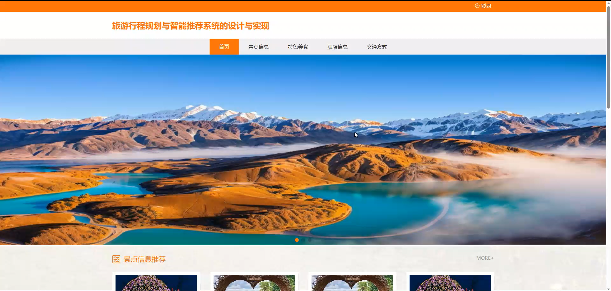
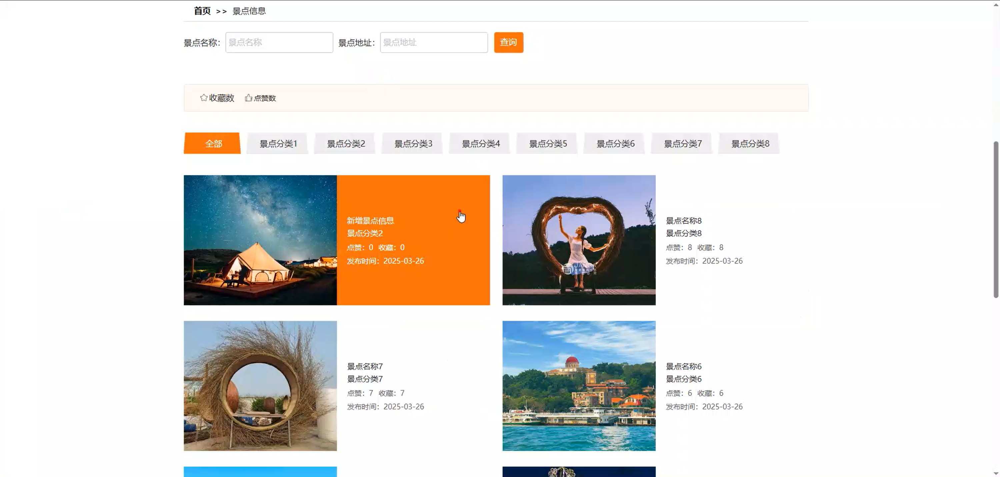
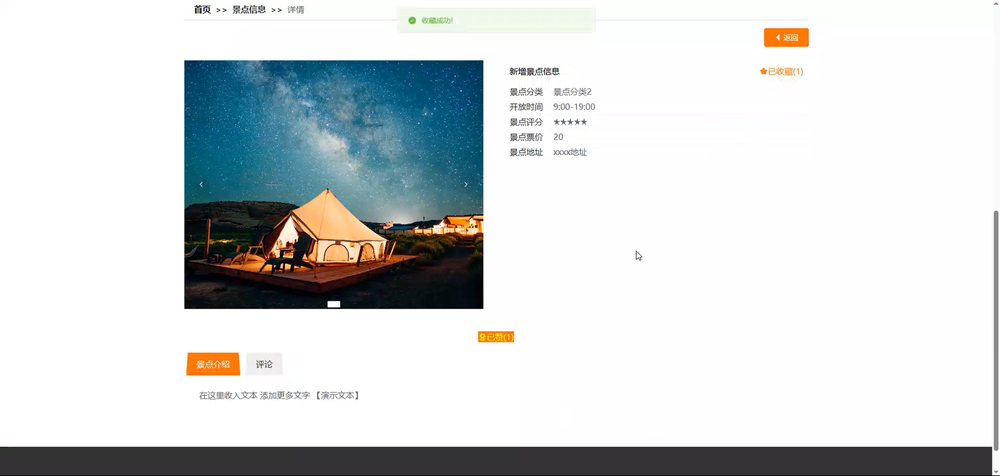
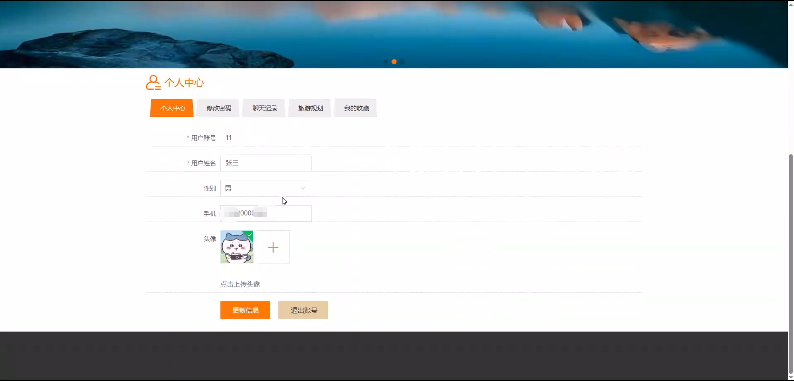
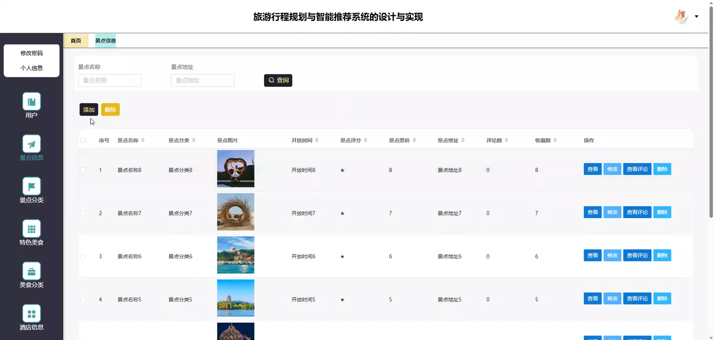
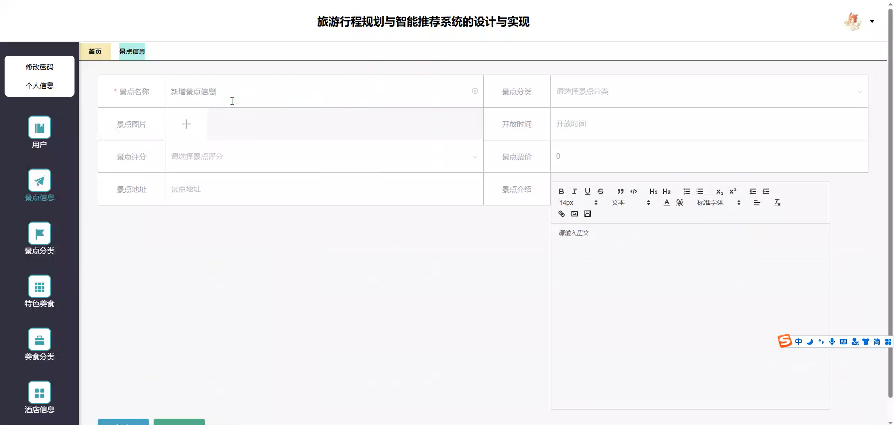
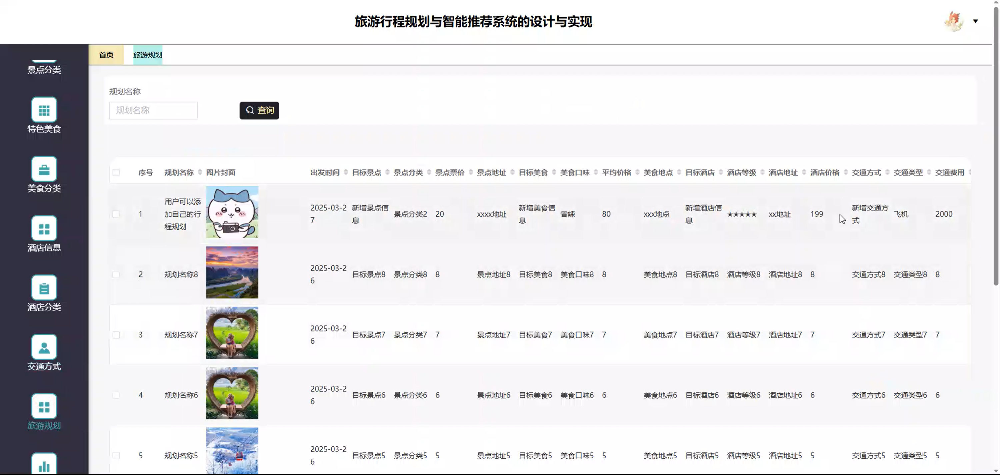
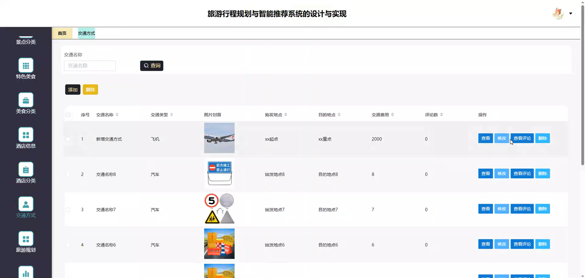

# springbootA431D
springbootA431D旅游行程规划与智能推荐系统
 
 
## 查看主页获取源码

### 一、关键词
景点信息、特色美食、酒店信息

### 二、作品包含
源码+数据库+全套环境和工具资源+本地部署教程

### 三、项目技术
前端技术：Html、Css、Js、Vue2.0、Element-ui 
后端技术：Java、SpringBoot2.0、MyBatis

### 四、运行环境（以下版本亲测，其他版本未知，请自测）
开发工具：IDEA/eclipse  + VSCODE

数据库：MySQL5.7（最低要5.7版本）

数据库管理工具：Navicat10以上版本

环境配置软件： JDK1.8 + Maven3.6.3

前端Nodejs：14

浏览器：谷歌浏览器

### 五、项目介绍
项目编号：springbootA431D

旅游行程规划与智能推荐系统可景点、美食、酒店等，帮助用户高效解决旅游决策与安排问题，提升出行体验。

角色：管理员、用户

用户功能：首页、景点信息、特色美食、酒店信息、交通方式、个人中心、修改密码、聊天记录、旅游规划、我的收藏。

管理员功能：系统首页、个人中心、用户、景点信息、景点分类、特色美食、美食分类、酒店信息、酒店分类、交通方式、旅游规划、轮播图管理。

### 六、运行截图

